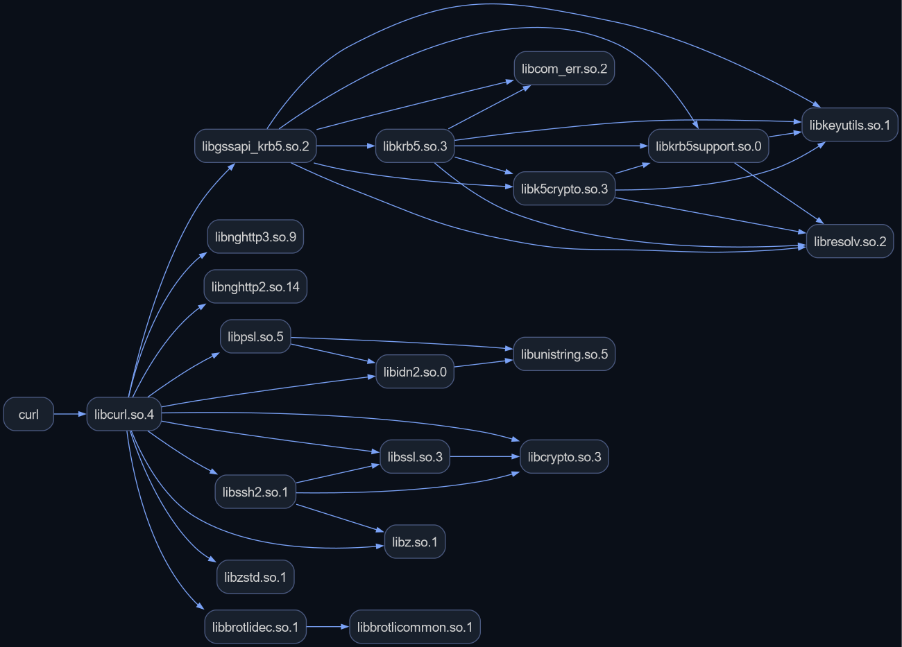
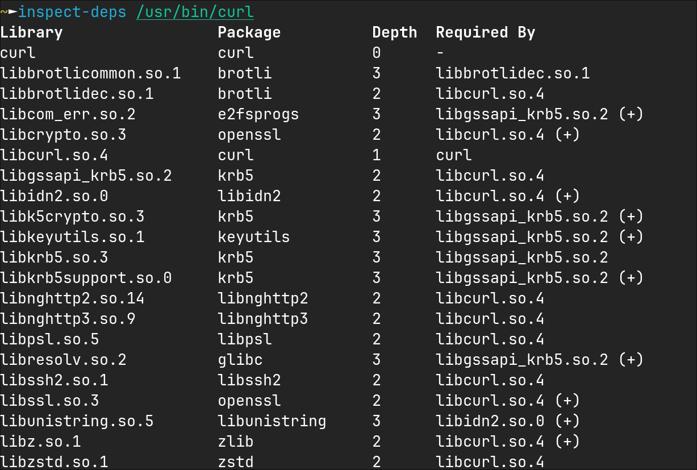
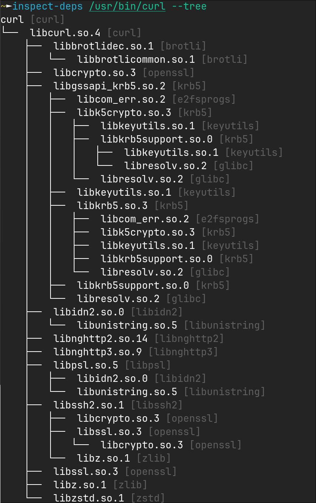
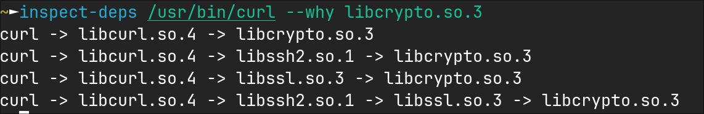

# inspect-deps

A command-line tool for analyzing ELF shared library dependencies and optionally map them to Arch Linux packages.



## Features

- Dependency tree visualization.
- Package resolution via libalpm (Pacman).
- Minimal package dependency calculation.
- Explanation of library presence.
- JSON and DOT export.
- Standalone operation; libalpm loaded dynamically.

## Limitations

- x86_64 architecture only.
- Package resolution requires libalpm.
- Simplified RPATH/RUNPATH handling.
- Does not detect dlopen-loaded libraries.

## Build

Requirements:

- CMake 3.28+
- C++23 compiler (GCC 13+ or Clang 16+)
- pkg-config

```bash
cmake -S . -B build
cmake --build build --parallel
# binary at build/inspect-deps
```

## Installation

PKGBUILD included. Available on AUR: https://aur.archlinux.org/packages/inspect-deps. Package resolution requires
pacman/libalpm.

## Usage

Default output (no mode flags): Compact tabular summary of libraries.

Columns:

- Library: SONAME.
- Package: Arch package (if libalpm available and enabled).
- Depth: Graph distance from root.
- Required By: Immediate parent (or "-" if none; "(+)" for multiple).

Options:

- --no-header: Suppress header.
- --no-pkg: Disable package resolution.
- ANSI colors when stdout is TTY.

Example:

```bash
inspect-deps /usr/bin/curl
```



#### Show dependency tree

```bash
inspect-deps /usr/bin/curl --tree
```



List minimal packages:

```bash
inspect-deps /usr/bin/vim --pkg-list
```

Explain library presence:

```bash
inspect-deps /usr/bin/curl --why libcrypto.so.3
```



Export to JSON/DOT:

```bash
inspect-deps /usr/bin/git --json
inspect-deps /usr/bin/git --dot > graph.dot
```

Generate completions:

```bash
inspect-deps --completions fish > ~/.config/fish/completions/inspect-deps.fish
```

## Requirements

- Linux (x86_64)
- libalpm (optional, for package resolution)
